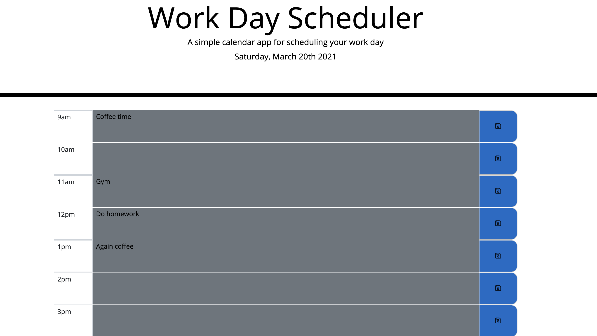

# workday-scheduler

## Description

This is simple work day scheduler. It displays time periods from 9 AM to 5 PM. User is able to store events in the time slots in the middle and save it by hitting save icon on the right. After reloading the page, all saved events will be displayed. 

### Link to application

https://dmitrybalduev.github.io/workday-scheduler/

### Screenshot

